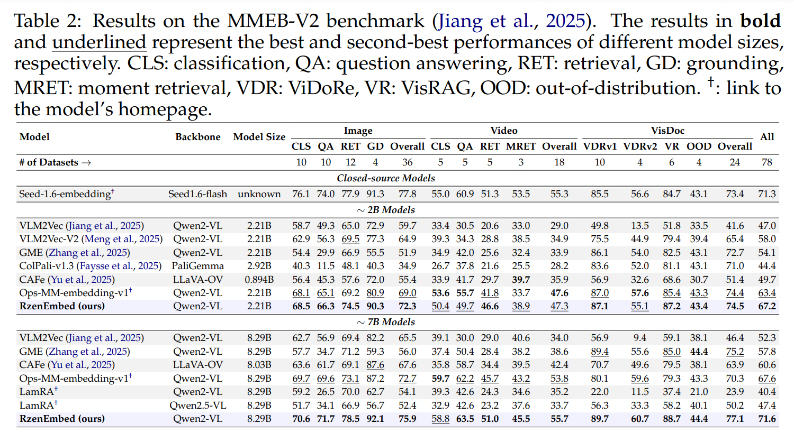

# RzenEmbed: Towards Comprehensive Multimodal Retrieval
Welcome to the official repository for **RzenEmbed**, a state-of-the-art model designed to generate powerful, general-purpose embeddings from a diverse set of data types.

RzenEmbed unifies understanding across modalities by processing inputs based on task instructions, making it a versatile tool for a wide array of downstream applications.

**[RzenEmbed: Towards Comprehensive Multimodal Retrieval](https://arxiv.org/abs/2510.27350)**
</br>
Weijian Jian, Yajun Zhang, Dawei Liang, Chunyu Xie, Yixiao He, Dawei Leng, Yuhui Yin
</br>
[](https://arxiv.org/abs/2510.27350)
[](https://huggingface.co/collections/qihoo360/rzenembed)
[](https://huggingface.co/spaces/TIGER-Lab/MMEB-Leaderboard)


## ✨ Key Features

*   **Unified Multimodal Embeddings**: Learns a single representation space for **text, visual documents, images, and video**.
*   **Instruction-Tuned**: Follows natural language instructions to adapt its embedding generation for specific tasks.
*   **Versatile and General-Purpose**: Produces embeddings that excel in various downstream tasks without task-specific fine-tuning.
*   **State-of-the-Art Performance**: Achieves top results on major multimodal benchmarks.

## 🏆 State-of-the-Art Results

As of September 2025, RzenEmbed achieves SOTA performance on the following benchmarks:
<div align='center'></div>


## 🔧 Usage


### Document Retrieval

Match text queries with document images for information retrieval.

```python
from rzen_embed_inference import RzenEmbed

rzen = RzenEmbed("qihoo360/RzenEmbed")

queries = [
    "What is the main variable being analyzed on the x-axis of these graphs?",
    "What is the personnel costs in the 4th year?"
]
candidates = [
    "assets/example3.jpg",
    "assets/example4.jpg",
]

query_instruction = "Find a document image that matches the given query: "
candidate_instruction = "Understand the content of the provided document image."

# Generate embeddings for document retrieval
query_embeds = rzen.get_fused_embeddings(instruction=query_instruction, texts=queries)
candidate_embeds = rzen.get_fused_embeddings(instruction=candidate_instruction, images=candidates)

# Calculate text-to-document similarity
similarity_scores = query_embeds @ candidate_embeds.T
print(similarity_scores)
```


### Video Retrieval

Retrieve videos based on text captions.

```python
import cv2
import numpy as np
from rzen_embed_inference import RzenEmbed

def extract_frames(video_path, num_frames):
    cap = cv2.VideoCapture(video_path)
    total_frames = int(cap.get(cv2.CAP_PROP_FRAME_COUNT))
    frame_indices = np.linspace(0, total_frames - 1, num_frames, dtype=int)
    frames = []
    for idx in frame_indices:
        cap.set(cv2.CAP_PROP_POS_FRAMES, idx)
        ret, frame = cap.read()
        if ret:
            frames.append(Image.fromarray(cv2.cvtColor(frame, cv2.COLOR_BGR2RGB)))
        else:
            break
    cap.release()
    return frames

rzen = RzenEmbed("qihoo360/RzenEmbed")

queries = [
    "A traditional boat glides along a river lined with blooming cherry blossoms under an overcast sky in a modern cityscape.",
    "Tiny ginger kitten meows cutely by the water."
]

# Extract frames from videos
video_path_list = [
    "assets/example5.mp4",
    "assets/example6.mp4",
]
candidates = [extract_frames(video_path, num_frames=8) for video_path in video_path_list]

query_instruction = "Find the video snippet that corresponds to the given caption: "
candidate_instruction = "Understand the content of the provided video."

# Generate embeddings for video retrieval
query_embeds = rzen.get_fused_embeddings(instruction=query_instruction, texts=queries)
candidate_embeds = rzen.get_fused_embeddings(instruction=candidate_instruction, images=candidates)

# Calculate text-to-video similarity scores
similarity_scores = query_embeds @ candidate_embeds.T
print(similarity_scores)
```


### Text-to-Image Retrieval

Retrieve images that match text captions.

```python
from rzen_embed_inference import RzenEmbed

rzen = RzenEmbed("qihoo360/RzenEmbed")

queries = [
    "A curious kitten and a gentle puppy share a moment of connection on the grass.",
    "Fresh fridge full of berries yogurt milk and snacks."
]
candidates = [
    "assets/example1.jpg",
    "assets/example2.jpg",
]

query_instruction = "Find me an everyday image that matches the given caption: "
candidate_instruction = "Represent the given image."

# Generate embeddings and compute similarity
query_embeds = rzen.get_fused_embeddings(instruction=query_instruction, texts=queries)
candidate_embeds = rzen.get_fused_embeddings(instruction=candidate_instruction, images=candidates)

# Calculate text-to-image similarity scores
similarity_scores = query_embeds @ candidate_embeds.T
print(similarity_scores)
```

### Image-to-Text Retrieval

Find text captions that best match given images.

```python
from rzen_embed_inference import RzenEmbed

rzen = RzenEmbed("qihoo360/RzenEmbed")

queries = [
    "assets/example1.jpg",
    "assets/example2.jpg",
]
candidates = [
    "A curious kitten and a gentle puppy share a moment of connection on the grass.",
    "Fresh fridge full of berries yogurt milk and snacks."
]

query_instruction = "Find an image caption describing the given everyday image."

query_embeds = rzen.get_fused_embeddings(instruction=query_instruction, images=queries)
candidate_embeds = rzen.get_fused_embeddings(texts=candidates)

# Calculate image-to-text similarity scores
similarity_scores = query_embeds @ candidate_embeds.T
print(similarity_scores)
```


## 📖 Citation
If you find RzenEmbed useful for your research and applications, please cite using this BibTeX:
```
@misc{jian2025rzenembedcomprehensivemultimodalretrieval,
      title={RzenEmbed: Towards Comprehensive Multimodal Retrieval}, 
      author={Weijian Jian and Yajun Zhang and Dawei Liang and Chunyu Xie and Yixiao He and Dawei Leng and Yuhui Yin},
      year={2025},
      eprint={2510.27350},
      archivePrefix={arXiv},
      primaryClass={cs.CV},
      url={https://arxiv.org/abs/2510.27350}, 
}
```
